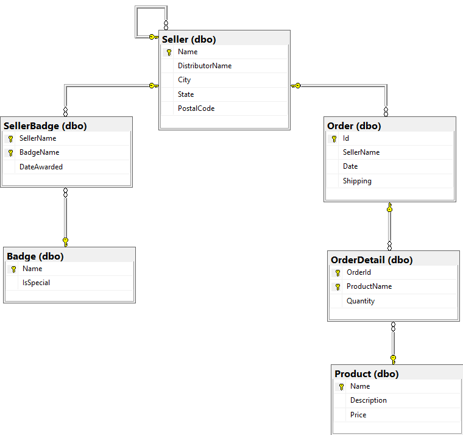

# Database Schema

We have two web pages where you can try out `GraphQL` queries. Both of them
use the same demo database.

The demo database has six tables. To keep things interesting, some of the tables
have auto-incrementing ID's, some have natural keys, and some have compound keys.
The `Seller` table is self-referencing.

The [Init Script](https://github.com/stevekerrick/GraphqlToTsql/blob/main/src/DemoEntities/DatabaseCreateScript.sql) has all the details, including the data that's scripted in.

Note: The demo websites and database are hosted in Azure using
the least expensive options possible. (The App Service is F1 (Free) and the database is Basic).
Expect uneven performance.

# GraphiQL

`GraphiQL` is an open source in-browser IDE for composing and 
testing GraphQL queries. The good part about `GraphiQL` is
that behind the scenes it issues an introspection query
to the GraphQL API, and thereafter it provides auto-complete
to help the user write queries.

<h2><a href="//graphqltotsqldemoapp.azurewebsites.net/graphiql" target="_blank">GraphiQL Demo App</a></h2>

# Sample Queries

`Sample Queries` is a UI showing
a wide assortment of sample queries. The user can modify them
or create one of their own. After a query is run, the page shows the
resulting data, the TSQL that was generated, and some runtime statistics.

<h2><a href="//graphqltotsqldemoapp.azurewebsites.net/" target="_blank">Sample Queries App</a></h2>

