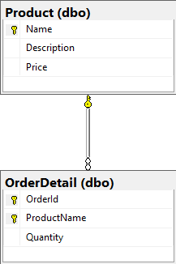

<div markdown="1">

# Get GraphqlToTsql

There are two ways to get `GraphqlToTsql`.

## Method 1: NuGet

Use Visual Studio's `Manage NuGet Packages for Solution` GUI to add GraphqlToTsql
to one of your projects.

> OR

If you are using .Net Framework, use the `nuget.exe` CLI to download the package:

```shell
nuget install GraphqlToTsql -OutputDirectory packages
```

> OR

If you are using .Net Core, use the `dotnet.exe` CLI to download the package:

```shell
dotnet add package GraphqlToTsql
```

## Method 2: Clone the GitHub Repository
Clone the [repo](https://github.com/stevekerrick/GraphqlToTsql),
and include project `GraphqlToTsql` in your solution.
</div>

<div markdown="1">

# Create Entity Mapping

`GraphqlToTsql` uses the "Entity Mapping" pattern to define the types and fields
that will be accessible in the GraphQL, and to map them to tables and columns in the
database.

Suppose you have a table named `Product`, which is related to the `OrderDetail` table
by a foreign key column named `ProductName`.



The Entity for the `Product` table could look like this:

```csharp
public class ProductDef : EntityBase
{
    public static ProductDef Instance = new ProductDef();

    public override string Name => "product";
    public override string DbTableName => "Product";
    public override string[] PrimaryKeyFieldNames => new[] { "name" };

    protected override List<Field> BuildFieldList()
    {
        return new List<Field>
        {
            Field.Column(this, "name", "Name", ValueType.String, IsNullable.No),
            Field.Column(this, "description", "Description", ValueType.String, IsNullable.Yes),
            Field.Column(this, "price", "Price", ValueType.Float, IsNullable.No),

            Field.Set(OrderDetailDef.Instance, "orderDetails", IsNullable.Yes, new Join(
                ()=>this.GetField("name"),
                ()=>OrderDetailDef.Instance.GetField("productName"))
            )
        };
    }
}
```

* See: The [Documentation page](/documentation) for guidance on mapping. `GraphqlToTsql` 
is flexible, allowing calculated fields, custom join criteria,
using Table Valued Functions, virtual tables, and more.
* See: [Demo Entities](https://github.com/stevekerrick/GraphqlToTsql/tree/main/src/DemoEntities)
in the project repository for more examples.

</div>

<div markdown="1">

# Create Entity List

`GraphqlToTsql` needs an instance of each of your Entities. When you execute a `GraphqlToTsql` Action, 
the entity list is set on a `GraphqlActionSettings` object.

The [Reference Application](https://github.com/stevekerrick/GraphqlToTsql/blob/main/src/DemoEntities/DemoEntityList.cs) uses a static class named `DemoEntityList` for this:

```csharp
public static class DemoEntityList
{
    public static List<EntityBase> All()
    {
        return new List<EntityBase>
        {
            BadgeEntity.Instance,
            OrderEntity.Instance,
            OrderDetailEntity.Instance,
            ProductEntity.Instance,
            SellerEntity.Instance,
            SellerBadgeEntity.Instance,
            SellerProductTotalEntity.Instance,
            SellerTotalEntity.Instance
        };
    }
}
```

</div>

<div markdown="1">

# Register GraphqlActions

If your application uses a DI container (such as AspNetCore's [IServiceCollection](https://docs.microsoft.com/en-us/aspnet/core/mvc/controllers/dependency-injection?view=aspnetcore-5.0)) there is one class to register.
* `GraphqlActions` implements interface `IGraphqlActions`.

For example:

```csharp
public class Startup
{
    public void ConfigureServices(IServiceCollection services)
    {
        services
            .AddScoped<IGraphqlActions, GraphqlActions>();
    }
}
```
</div>

<div markdown="1">

# Wire Up the API

`GraphqlToTsql` is a component to translate a *GraphQL* query into a *TSQL* query, 
and to execute the query for you.
*You* provide the web service/controller, however.

The request/response models are therefore under your control.
But if you want your GraphQL endpoint to "play nice" with other components in the
GraphQL ecosphere, such as the [ReactJs Apollo Client](https://www.apollographql.com/docs/react/),
you need to follow the [GraphQL spec](https://graphql.org/learn/serving-over-http/),
which dictates the shapes of the request/response objects.

The `GraphqlToTsql` reference application has an AspNetCore project that follows the spec,
though the response object includes some extra properties.
Here is the controller that exposes the endpoint `/api/graphql`.

```csharp
using DemoEntities;
using GraphqlToTsql;
using Microsoft.AspNetCore.Mvc;
using Microsoft.Extensions.Configuration;
using Newtonsoft.Json;
using System;
using System.Collections.Generic;
using System.Threading.Tasks;

namespace DemoApp.Controllers
{
    [Route("api/[controller]")]
    [ApiController]
    public class GraphqlController : ControllerBase
    {
        private readonly IConfiguration _configuration;
        private readonly IGraphqlActions _graphqlActions;

        public GraphqlController(
            IConfiguration configuration,
            IGraphqlActions graphqlActions)
        {
            _configuration = configuration; ;
            _graphqlActions = graphqlActions;
        }

        [HttpPost]
        public async Task<JsonResult> Post([FromBody] QueryRequest query, bool? showStatistics)
        {
            var result = await RunQuery(query);

            object response;
            if (showStatistics.GetValueOrDefault())
            {
                response = result;
            }
            else if (result.Errors != null)
            {
                response = new { result.Errors, ErrorCode = result.ErrorCode.ToString() };
            }
            else
            {
                response = new { result.Data };
            }

            return new JsonResult(response);
        }

        private async Task<QueryResponse> RunQuery(QueryRequest query)
        {
            var graphql = query.Query;
            var graphqlParameters = string.IsNullOrEmpty(query.Variables)
                ? null
                : JsonConvert.DeserializeObject<Dictionary<string, object>>(query.Variables);

            var connectionString = _configuration.GetConnectionString("DemoDB");
            if (string.IsNullOrEmpty(connectionString) || connectionString == "set in azure")
            {
                throw new Exception("Database connection string is not set");
            }

            var settings = new GraphqlActionSettings
            {
                AllowIntrospection = true,
                EntityList = DemoEntityList.All(),
                ConnectionString = connectionString
            };

            var queryResult = await _graphqlActions.TranslateAndRunQuery(graphql, graphqlParameters, settings);

            var errors =
                queryResult.TranslationError != null ? new[] { queryResult.TranslationError }
                : queryResult.DbError != null ? new[] { queryResult.DbError }
                : null;

            return new QueryResponse
            {
                Data = Deserialize(queryResult.DataJson),
                Errors = errors,
                Tsql = queryResult.Tsql,
                TsqlParameters = queryResult.TsqlParameters,
                Statistics = queryResult.Statistics,
                ErrorCode = queryResult.ErrorCode.ToString()
            };
        }

        private static object Deserialize(string json)
        {
            if (json == null) return null;
            return JsonConvert.DeserializeObject(json);
        }
    }

    // The shape of the QueryRequest is dictated by the GraphQL standard
    public class QueryRequest
    {
        // The GraphQL query
        public string Query { get; set; }

        // The GraphQL variable values, in JSON format
        public string Variables { get; set; }
    }

    public class QueryResponse
    {
        // These parts are dictated by the GraphQL standard
        public object Data { get; set; }
        public string[] Errors { get; set; }

        // These parts are extra
        public string Tsql { get; set; }
        public Dictionary<string, object> TsqlParameters { get; set; }
        public List<Statistic> Statistics { get; set; }
        public string ErrorCode { get; set; }
    }
}
```

</div>

<div markdown="1">

# Optional: Wire Up the DB

`GraphqlToTsql` is meant to be a flexible component of your .NET API.
It is happy to execute the GraphQL query -- simply supply the database connection string, 
and call `TranslateAndRunQuery`.

```csharp
var settings = new GraphqlActionSettings
{
    AllowIntrospection = false,
    EntityList = DemoEntityList.All(),
    ConnectionString = _configuration.GetConnectionString("DemoDB")
};

var queryResult = await _graphqlActions.TranslateAndRunQuery(graphql, graphqlParameters, settings);
```

If you prefer to have more control over the database access you can use `TranslateToTsql` to create the TSQL
query (and associated TSQL Parameters), then submit the query to the database yourself.

```csharp
var settings = new GraphqlActionSettings
{
    AllowIntrospection = false,
    EntityList = DemoEntityList.All()
};

var tsqlResult = await _graphqlActions.TranslateToTsql(graphql, graphqlParameters, settings);
// If tsqlResult.Error is not null it means the query was faulty
// Otherwise, the results are in tsqlResult.Tsql and tsqlResult.TsqlParameters
```

* See: [IGraphqlActions interface](https://github.com/stevekerrick/GraphqlToTsql/blob/main/src/GraphqlToTsql/GraphqlActions.cs)
* See: [DbAccess](https://github.com/stevekerrick/GraphqlToTsql/blob/main/src/GraphqlToTsql/Database/DbAccess.cs),
the class in `GraphqlToTsql` that sends queries to the database. It uses the Micro ORM [Dapper](https://github.com/StackExchange/Dapper)

</div>
